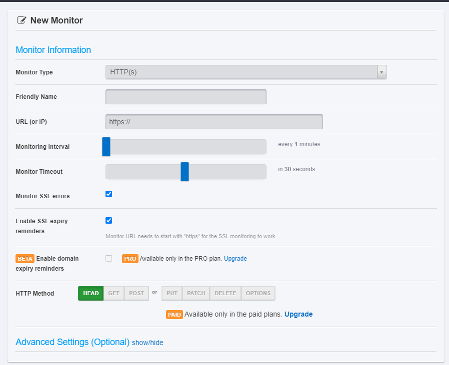

# replit-discord-bot-sample

怎麼讓他24/7運行？

去 [UptimeRobot](https://uptimerobot.com/)註冊，註冊完後去郵箱認證。

結束後，先找到下面這個`Monitor`


點下去，出現下圖


選`HTTPS`，name看你要打甚麼都可以，`url`的部分，去拿replit剛剛用flask跑出來的url
```
name.your_github_email.repl.co
```
長的很類似，複製過去後直接貼上，前面的`https://`保留不要刪。

這裡調5分鐘


按下 `Create Monitor`


接著就可以 `close`了，結案。

如果要更新bot的話，可以用pause


不過還是會自動開啟，可以刪掉後重弄也還好，不差這點時間。